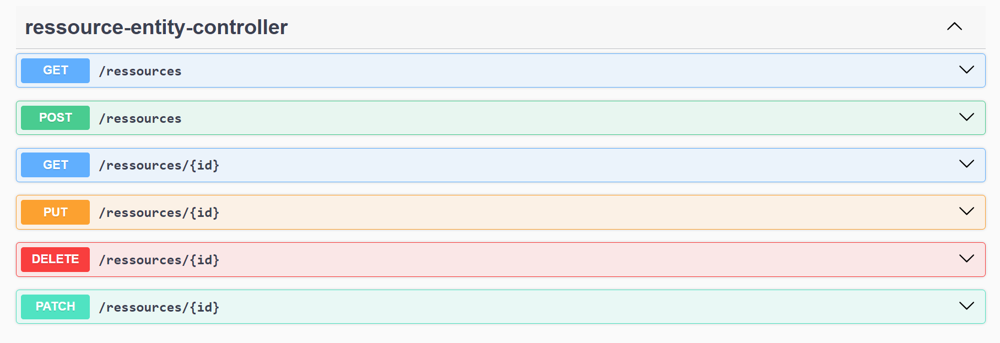
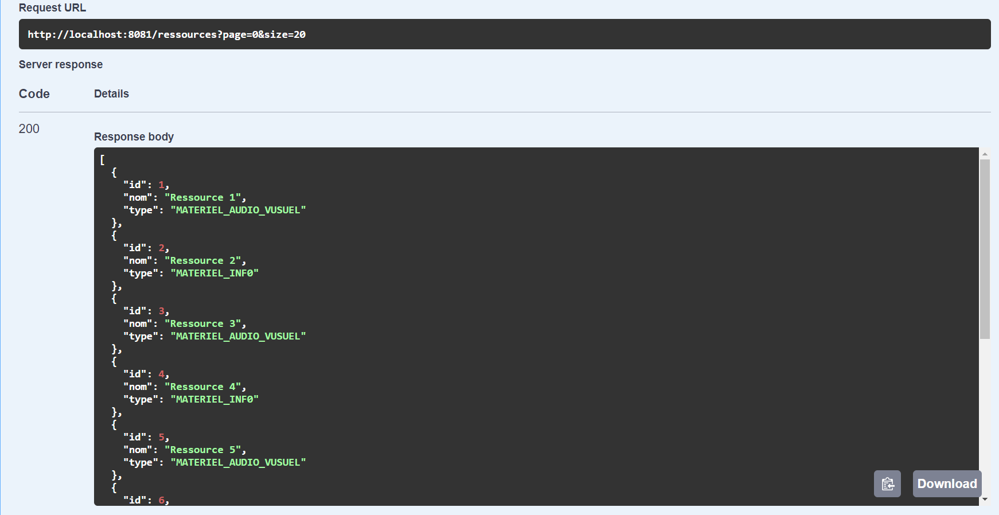
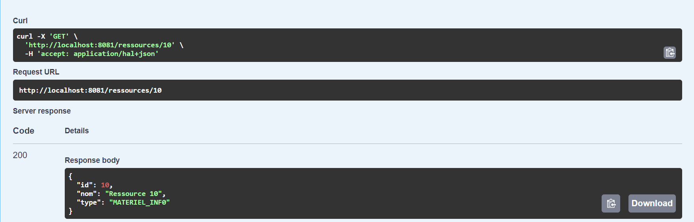

# Radar Management 

## Introduction

The aim of this project is to create a distributed system based on micro-services.This application allows to manage and automate the process of vehicle infractions following speed overruns detected by automatic radars. The system consists of three micro-services :
- Registration Service : allows to manage vehicles and their owners.
- Radar Service : allows to manage radars.
- Violation Service : manage the cars violations that detected by radars.

## Outils


```
- Spring Boot
- Spring Cloud
- Eureka Discovery
- H2DataBase
- Keycloak
```

## Project Architecture 
<table align="center">
  <tr></tr>
</table>
<br><br>
## Project Structure 

<br><br>
## Eureka Service 
<table align="center">
  <tr>
    <th>Run</th>
    <th>Test</th>
  </tr>
  <tr>
    <td></td>
    <td></td>
  </tr>
</table>

<br><br>
## Config & Gateway Service
<table align="center">
  <tr>
    <th>Config Actuator</th>
    <th>Gateway Actuator</th>
  </tr>
  <tr>
    <td></td>
    <td></
  </tr>
</table>

<br><br>
## Ressource Service API Doc
<table align="center">
  <tr>
    <th>Rest API</th>
    <th>Get</th>
   </tr>
  <tr>
    <td></td>
    <td></td>
  </tr>
    <th>Post</th>
    <th>Get Id</th>
  <tr>
    <td></td>
    <td></td>
  </tr>
   </tr>
    <th>Update</th>
    <th>Delete</th>
  <tr>
    <td></td>
    <td></td>
  </tr>
</table>

<br><br>
## Reservation Service API Doc
<table align="center">
  <tr>
    <th>Reservation Rest API</th>
    <th>Personne Rest API</th>
   </tr>
  <tr>
    <td></td>
    <td></td>
  </tr>
    <th>Get Reservation</th>
    <th>Post Personne</th>
  <tr>
    <td></td>
    <td></td>
  </tr>
  </tr>
    <th>Update Reservation</th>
    <th>Delete Personne</th>
  <tr>
    <td></td>
    <td></td>
  </tr>
</table>

<br><br>
## OpenFeign & CircuitBreaker

<br><br>
## Angular Frontend
<table align="center">
  <tr>
    <th>Authentication</th>
    <th>Home</th>
   </tr>
  <tr>
    <td></td>
    <td></td>
  </tr>
  <tr>
    <th>Ressource Table</th>
    <th>Search</th>
  </tr>  
  <tr>
    <td></td>
    <td></td>
  </tr>
  <tr>
    <th>Add</th>
    <th>Overview</th>
  </tr>
  <tr>
    <td></td>
    <td></td>
  </tr>
  <tr>
    <th>Update</th>
    <th>Overview</th>
  </tr>
  <tr>
    <td></td>
    <td></td>
  </tr>
  <tr>
    <th>Ressource Reservation</th>
    <th>Overview</th>
  </tr>
  <tr>
    <td></td>
    <td></td>
  </tr>
</table>
<br><br>
<table align="center">
  <tr>
    <th>Reservation Table</th>
    <th>Search</th>
  </tr>  
  <tr>
    <td></td>
    <td></td>
  </tr>
  <tr>
    <th>Add</th>
    <th>Overview</th>
  </tr>
  <tr>
    <td></td>
    <td></td>
  </tr>
  <tr>
    <th>Update</th>
    <th>Overview</th>
  </tr>
  <tr>
    <td></td>
    <td></td>
  </tr>
  <tr>
    <th>Delete</th>
    <th>Reservation detail</th>
  </tr>
  <tr>
    <td></td>
    <td></td>
  </tr>
</table>
<br><br>
<table align="center">
  <tr>
    <th>Personne Table</th>
    <th>Search</th>
  </tr>  
  <tr>
    <td></td>
    <td></td>
  </tr>
  <tr>
    <th>Add</th>
    <th>Overview</th>
  </tr>
  <tr>
    <td></td>
    <td></td>
  </tr>
  <tr>
    <th>Update</th>
    <th>Overview</th>
  </tr>
  <tr>
    <td></td>
    <td></td>
  </tr>
  <tr>
    <th>Delete</th>
    <th>Personne detail</th>
  </tr>
  <tr>
    <td></td>
    <td></td>
  </tr>
</table>

## Application Security


## License
[MIT LICENSE](LICENSE)

