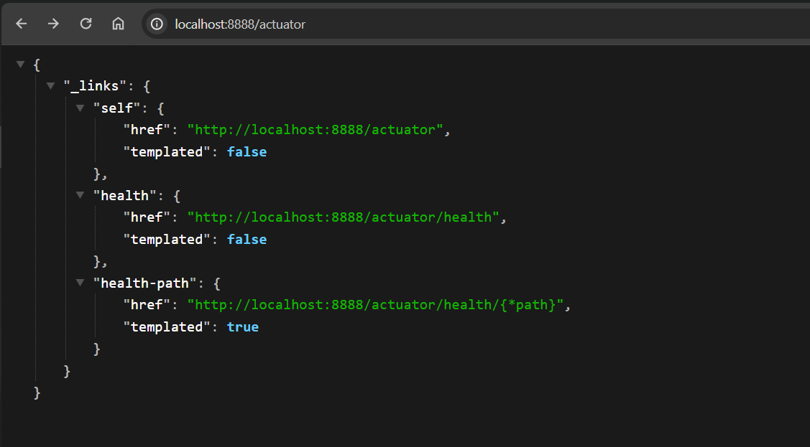
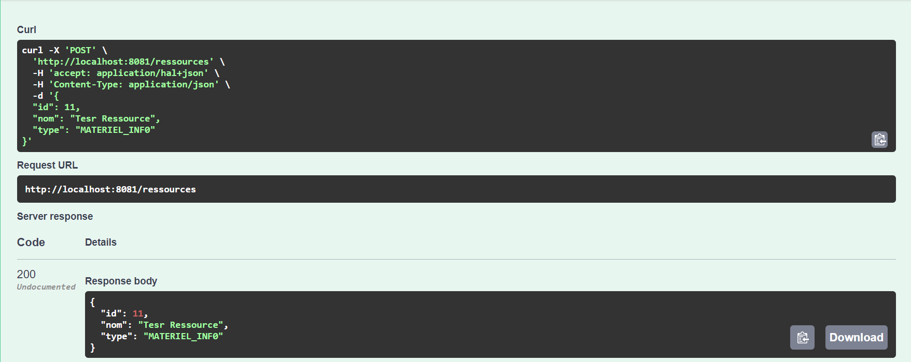
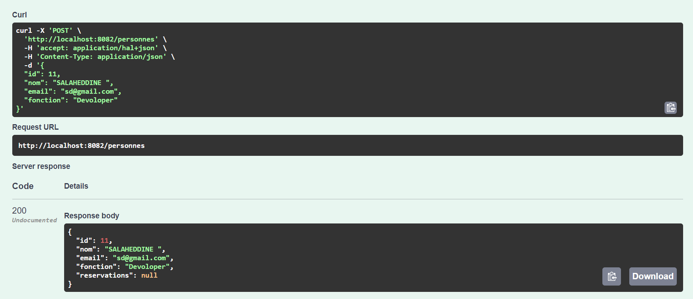
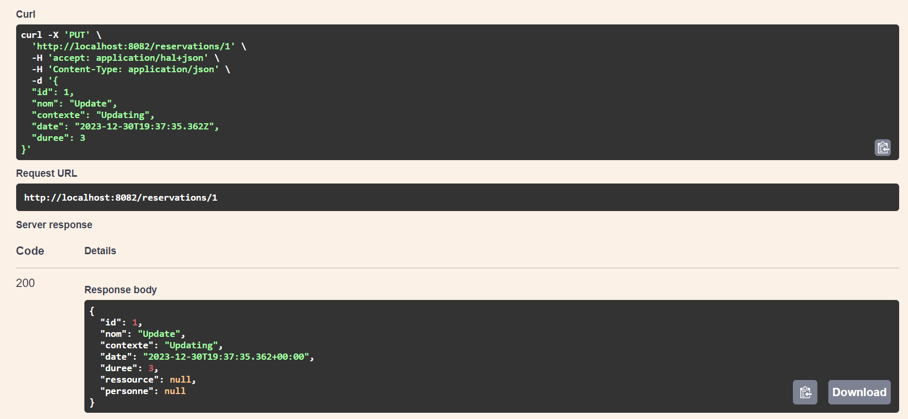

# Radar Management 

## Introduction

The aim of this project is to create a distributed system based on micro-services.This application allows to manage and automate the process of vehicle infractions following speed overruns detected by automatic radars. The system consists of three micro-services :
- Registration Service : allows to manage vehicles and their owners.
- Radar Service : allows to manage radars.
- Violation Service : manage the cars violations that detected by radars.

## Outils


```
- Spring Boot
- Spring Cloud
- Eureka Discovery
- H2DataBase
- Keycloak
```

## Project Architecture 
<table align="center">
  <tr></tr>
</table>

## Project Structure 


## Eureka Service 
<table align="center">
  <tr>
    <th>Run</th>
    <th>Test</th>
  </tr>
  <tr>
    <td></td>
    <td></td>
  </tr>
</table>

## Config Service
<table align="center">
  <tr>
    <th>Config with Actuator</th>
  </tr>
  <tr>
    <td></td>
  </tr>
</table>

## Gateway Service
<table align="center">
  <tr><th>Gateway with Actuator</th></tr>
  <tr><td></td></tr>
</table>

## Ressource Service API Doc
<table align="center">
  <tr>
    <th>Rest API</th>
    <th>Get</th>
   </tr>
  <tr>
    <td></td>
    <td></td>
  </tr>
    <th>Post</th>
    <th>Get Id</th>
  <tr>
    <td></td>
    <td></td>
  </tr>
   </tr>
    <th>Update</th>
    <th>Delete</th>
  <tr>
    <td></td>
    <td></td>
  </tr>
</table>

## Reservation Service API Doc
<table align="center">
  <tr>
    <th>Reservation Rest API</th>
    <th>Personne Rest API</th>
   </tr>
  <tr>
    <td></td>
    <td></td>
  </tr>
    <th>Get Reservation</th>
    <th>Post Personne</th>
  <tr>
    <td></td>
    <td></td>
  </tr>
  </tr>
    <th>Update Reservation</th>
    <th>Delete Personne</th>
  <tr>
    <td></td>
    <td></td>
  </tr>
</table>

## Violation Service
<table align="center">
  <tr>
    <th>Rest</th>
    <th>SOAP</th>
   </tr>
  <tr>
    <td></td>
    <td></td>
  </tr>
    <th>GraphQL</th>
    <th>GRPC</th>
  <tr>
    <td></td>
    <td></td>
  </tr>
</table>

## Web Application
<table align="center">
  <tr>
    <th>Authentication</th>
    <th>Home</th>
   </tr>
  <tr>
    <td></td>
    <td></td>
  </tr>
  <tr>
    <th>Table</th>
    <th>Search</th>
  </tr>  
  <tr>
    <td></td>
    <td></td>
  </tr>
  <tr>
    <th>Owner Detail</th>
    <th>Violation Detail</th>
  </tr>  
  <tr>
    <td></td>
    <td></td>
  </tr>
  <tr>
    <th>Add</th>
    <th>Update</th>
  </tr>
  <tr>
    <td></td>
    <td></td>
  </tr>
</table>


## License
[MIT LICENSE](LICENSE)

